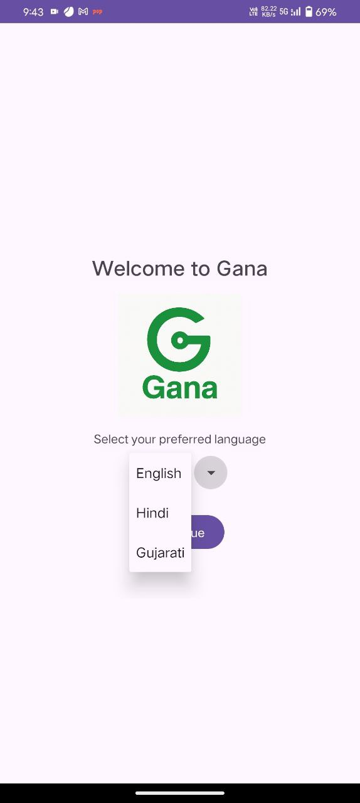
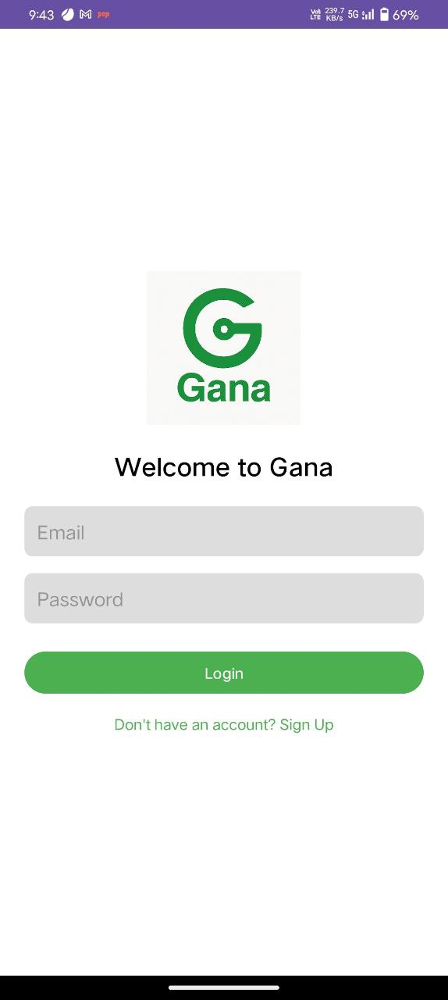
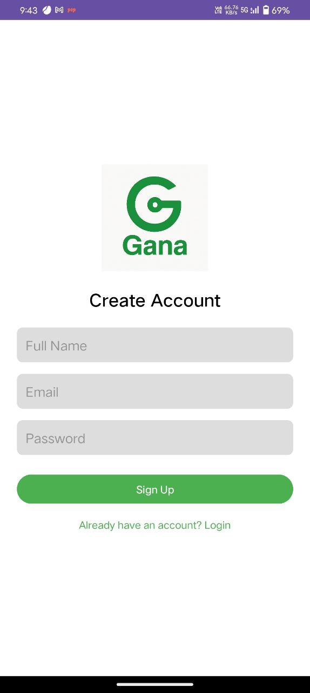
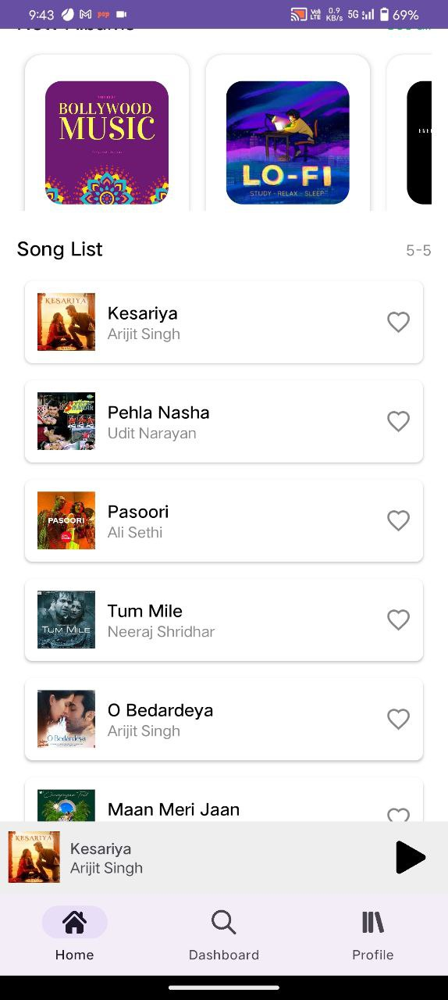
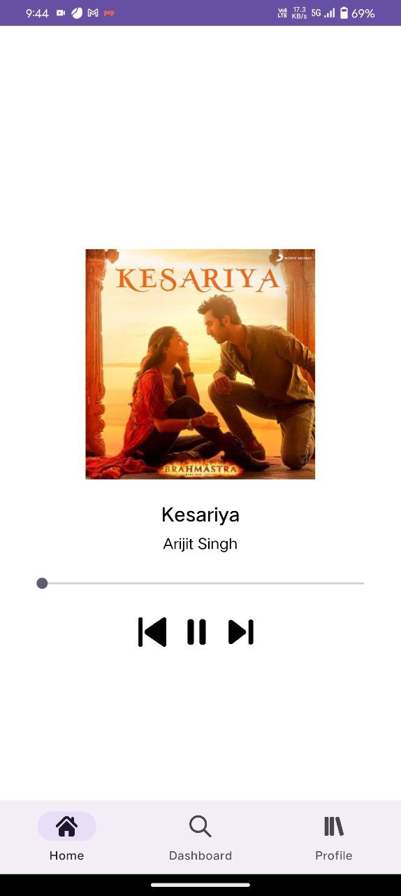
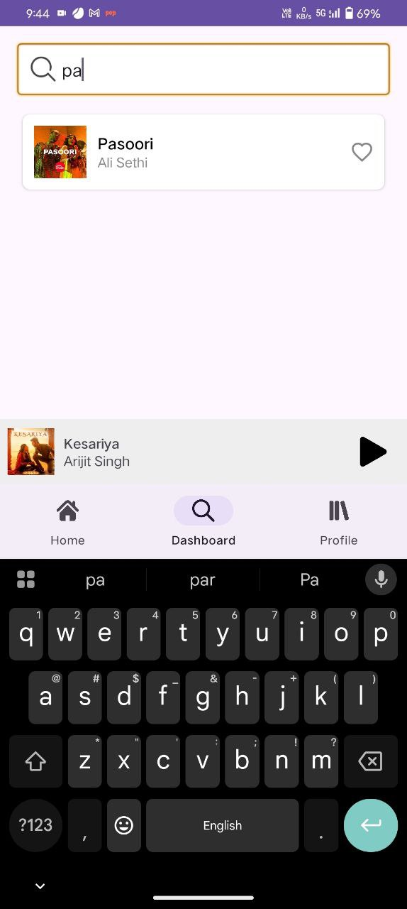
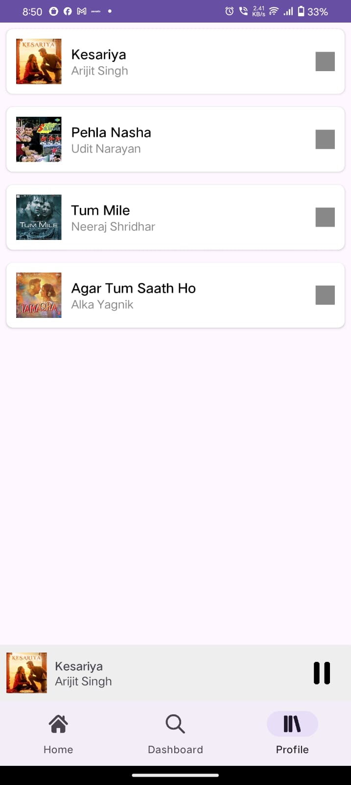
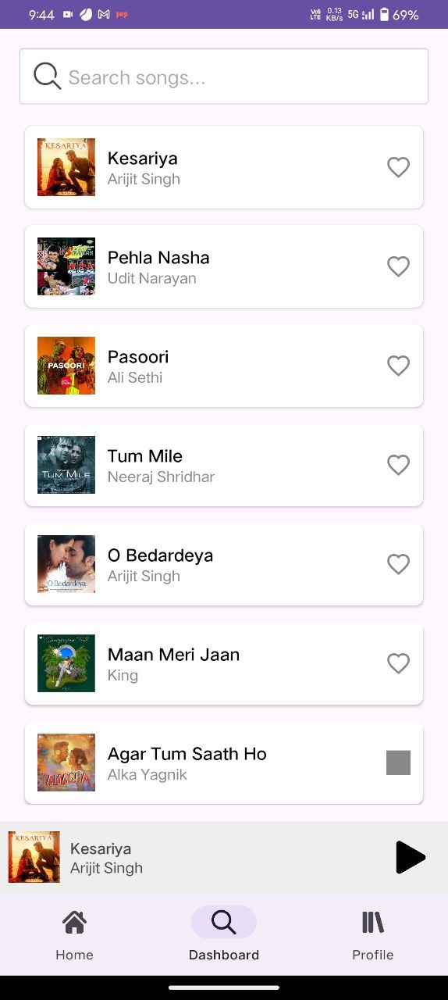

## 📱 About
**Gana** is a feature-rich music streaming Android application developed as a university project. The app provides a comprehensive music experience with user authentication, multi-language support, and an intuitive interface for discovering and playing music.

## ✨ Features

### 🔐 User Authentication
- **Login System**: Secure user login functionality
- **User Registration**: New user signup with database integration
- **Session Management**: Persistent user sessions

### 🌐 Multi-Language Support
- **English**: Default language
- **Hindi (हिन्दी)**: Complete Hindi localization
- **Gujarati (ગુજરાતી)**: Full Gujarati language support
- **Language Selection**: Dedicated language selection screen

### 🎵 Music Features
- **Home Screen**: Featured music and recommendations
- **Music Library**: Organized collection of songs and albums
- **Search Functionality**: Find songs, artists, and albums quickly
- **Audio Playback**: Full-featured music player with controls
- **Album Management**: Browse music by albums with cover art
- **Favorites**: Mark and manage favorite songs

### 🎨 User Interface
- **Bottom Navigation**: Easy navigation between Home, Search, Library, and Songs
- **Modern Design**: Material Design principles with custom styling
- **Album Art**: High-quality album covers and song thumbnails
- **Responsive Layout**: Optimized for different screen sizes
- **Smooth Animations**: Custom slide animations for enhanced UX

### 🗄️ Data Management
- **SQLite Database**: Local database for user data and music metadata
- **Music Storage**: Local storage of audio files in raw resources
- **Persistent Storage**: User preferences and session data

## 📱 Screenshots

| Feature | Screenshot |
|---------|------------|
| **Language Selection** |  |
| **Login Screen** |  |
| **Sign Up** |  |
| **Home Screen** |  |
| **Music Player** |  |
| **Search Interface** |  |
| **Library View** |  |
| **Songs List** |  |

## 🎥 Demo Video
📹 [Watch the app demo](Screenshots/Screenrecording_20250813_094843.mp4)

## 🛠️ Technical Specifications

### Development Environment
- **IDE**: Android Studio
- **Language**: Java
- **Build System**: Gradle (Kotlin DSL)
- **Min SDK**: API 33 (Android 13)
- **Target SDK**: API 34 (Android 14)

### Architecture & Components
- **Database**: SQLite with custom DatabaseHelper
- **UI Framework**: Android Views with Fragments
- **Navigation**: Bottom Navigation with Fragment management
- **Adapters**: RecyclerView adapters for Songs and Albums

## 🚀 Installation & Setup

### Prerequisites
- Android Studio (latest version)
- Android SDK with API 33+
- Java 11 or higher

### Build the Project
1. Clone the repository: `git clone https://github.com/jaypatwa/Gana1.git`
2. Open the project in Android Studio.
3. Sync Gradle and build the project.
4. Run on an Android device or emulator (API 33+).

## 📝 License

This project is developed as a university assignment for educational purposes. All rights reserved to the original developers.

## 👥 Development Team

- **Developer**: Jay Patwa
- **Email**: patwajay2101@gmail.com
- **Linkedin**:https://www.linkedin.com/in/jay-patwa-b625031b2/
